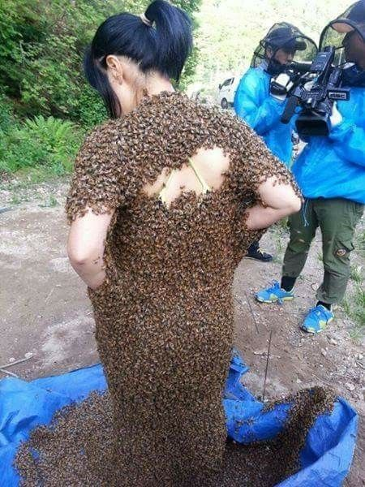

# Niña de Abejas

**Autor: Gabriel Benítez**  
**Un relato del taller LeGuin de Laberinto**

## 1.

Nikki siguió a su hermana a las cajas de abejas aquel día. Lo hizo a escondidas porque sabia bien que si ella se enteraba la golpearía. Pero Nikki era muy hábil para eso de espiar a las personas y Carolina nunca llegó a enterarse de lo que vio su hermana en los apiarios aquella tarde. Por su parte, Nikki hubiera preferido no haberlo visto nunca…

Los apiarios se encontraban cerca de la pequeña carretera que baja de la autopista principal hacia la colonia. Se deslizaba aproximadamente unos 700 metros a través del bosque para después convertirse en una curva cerrada que daba acceso a las casas del lugar. Ahí, en medio de la herradura del camino y la colonia, situadas entre un claro de arboles se encontraban las cajas de abejas, a buen resguardo de lluvia, viento y nieve.

La cajas no eran muchas, en realidad. Seis, siete tal vez.

Nikki nunca llegó a saber quien las había puesto ahí o quien se encargaba de ellas. Ignoraba también si obtenían de la cajas miel para venderla o para el consumo de la misma colonia, pero lo que no ignoraba es que tenia prohibido entrar al claro.

Ella y Carolina.

Sin embargo a Carolina esa advertencia no le importaba. Nikki sabia que ella acudía a las cajas de abejas casi dos veces a la semana desde hacia más de un año. Siempre se las arreglaba para salir y no ser descubierta. Nikki, por supuesto, estaba bajo amenaza. Si me sigues, o si mi papá o mi mamá se llegan a enterar –le había dicho – matare a tus barbies y quemaré la casa de tus Sweet Babies. Te lo juro. Nikki le creía. Su hermana era capaz, lo bastante capaz.

Pero esta vez iba a jugársela. Esta vez la curiosidad pesaba más que la seguridad de sus muñecos. Además, en cierta forma ya no le importaba tanto si su hermana cumplía la amenaza. A sus ocho años - según su abuela - ya estaba grande para jugar con esas cosas. Que Carolina quemara a las Sweet Babies si quería… esta vez, ella se iba a enterar de que era lo que hacia su hermana en los apiarios.

## 2.
Nikki volvió a su casa en la colonia exactamente para el cumpleaños de su hermana. Cuando llegó no vio nada muy diferente. Los prados continuaban bien cortados, las casas bien pintadas y la alberca llena de niños. En primavera la alberca siempre se llenaba. Nikki sonrió.

Su padre señalo hacia el lugar, mientras disminuía la velocidad del automóvil en que iban.

-¿Que te parece? ¿Traes tu traje de baño?

-No, creo que no. –contestó Nikki.

-Bueno, tendremos que comprarte otro. Recuérdale a Roberto que traiga el suyo.

-Rodolfo, papá. –aclaró Nikki con una sonrisa. – Se llama Rodolfo.

-Si, pues…avísale al Ruperto ese –su padre también sonrió.

Las casas de la colonia eran construcciones de madera al estilo de las del sur-este de los Estados Unidos, ya saben, blancas por fuera, con garaje y porche y un buen trozo de jardín rodeándolas. Todas eran así por que en esa colonia habían vivido antes los ingenieros norteamericanos, cuando aún eran ellos los que se encargaban de la mina. Todavía quedaban unos cuantos: El señor Faulkner, Mr. Reynolds, la señorita Petrucci, encargada del comedor de ingenieros y de la cocina del club (Nikki esperaba con ansia las Navidades solo por el pavo con greiby que preparaba ella). De cualquier forma el lugar no había cambiado mucho y continuaba con ese aspecto tranquilo y seguro que había tenido siempre. A Rodolfo le gustaría. Según él, no había nada mejor que las montañas y el bosque. Pues bien, desde la ventana del cuarto donde se hospedaría se podían observar muy bien las montañas, y si caminaba un poco tendría frente a si al bosque.

Pero eso no era nada por que lo mejor eran las tardes. Tardes de verano, serenas y silenciosas, con esas puestas de sol tranquilas que permiten escuchar el tenue silbido del viento en los arboles. Vaya, eso si que era romántico, pensó Nikki . Toda una oportunidad.

La casa de Nikki se ajustaba perfectamente al molde de las demás. Era de un solo piso, pero como estaba construida a desnivel, hubo la oportunidad de agregar unos cuartos en la parte baja, los cuales daban al jardín trasero y al garaje, donde su padre estacionó el automóvil

Nikki bajó del vehículo y caminó a la parte delantera de la casa, a través del jardín mientras su padre se desasía por bajar y cargar la gran cantidad de maletas de su hija.

-Ahorita te ayudo. – le gritó ella. – Primero quiero saludar a mi mamá.

Nikki encontró a su mamá esperándola en la puerta y después de saludarse y abrasarse dio un vistazo rápido a la sala.

-¿Y Carolina? –

-Aún no sale de trabajar. –dijo su mamá - Apenas son las dos y ella sale a las cuatro, igual que tu padre… ¿y sabes que? Mejor ve a ayudarlo porque aún tiene que regresar al trabajo.

-Ok. Ahorita regreso. – Nikki corrió hacia la figura sobrecargada de maletas de su padre.

-Oye Nikki, ¿desayunaste algo? ¿Tienes hambre? –preguntó su madre.

-No mamá, gracias. Comí un sandwish en el autobús…. A ver papá, préstame esta maleta y el neceser.

-No es necesario, yo puedo solo.

-Manuel. Deja que tu hija te ayude.

-¿Pero por que? ¡Si yo puedo con todo…!

## 3.
Nikki supo que Carolina estaba lista para ir al apiario porque la vio salir con su vestido azul y la lonchera de plástico en la mano. Nikki decidió que ese era el día correcto para seguirla. Y era el día correcto porque era un día especial. Tenía que serlo: Desde hacia dos días, Nikki había observado a su hermana arreglar y preparar todo, casi con el cuidado de un ritual. Había comenzado cuando fue su decimotercer cumpleaños. Saco del closet ese vestido que traía puesto y lo lavo y planchó ella misma para tenerlo listo precisamente para hoy, y en la mañana se había levantado temprano para prepararse dos sandwishes que guardaría en su lonchera. También esta era azul.

Nikki no supo que pretexto le dio a su mamá para poder salir tan temprano, pero el caso es que Carolina se fue como a eso de las nueve. Cinco minutos mas tarde salió también ella no sin antes dejar una nota en la mesa de la cocina: “Fui al Club por un Chocolate”.

Nikki dio un rodeo para llegar al apiario. No fue por la brecha principal, pensando que lo más seguro era que Carolina la estuviera vigilando. Corrió hacia la casa de los Faulkner, la ultima casa de la colonia y entró a su patio para cortar a la derecha en dirección a los zarzales y a los arboles. Calculó la forma de llegar. Caminaría en silencio y se colocaría detrás de uno de los arboles cubiertos de arbustos. Si tenía cuidado podría ver todo a la perfección y su hermana no notaría nada.

Fue entonces cuando algo en el suelo llamó su atención.

Un hilo cruzaba de lado a lado su camino. Era un hilo verde y fino que casi se confundía con la vegetación. Nikki se acercó con curiosidad y siguió el hilo con su mirada. El hilo iba a meterse exactamente entre un grupo de arbustos. De seguro alguien lo había amarrado ahí para algo. Caminó casi de puntillas hasta estos y escarbo con cuidado en ellos.

Efectivamente, de ahí estaba sujeto el hilo , pero lo más sorprendente era ver lo que estaba amarrado a las ramas de este. Eran cascabeles.

Y eran lo suficiente mente numerosos para alertar a alguien de la llegada de un intruso que topara con el hilo y moviera todo.

Carolina lo había preparado. No había duda.

Nikki salto con precaución por sobre el hilo y continuó caminando más despacio que antes, poniendo toda su atención en el suelo. Si ahí había encontrado uno de ellos de seguro debía haber más. Y si había más de seguro que también rodeaban toda el área.

Carolina estaba determinada a no ser descubierta.

Bueno… En ese casó Nikki también y su hermana no iba a detenerla.

## 4.
El infierno volvió poco después de las cuatro.

No era un secreto para nadie en la casa que Nikki y Carolina no se llevaban bien. Habían aprendido a tolerarse, pero hasta ahí.

A veces Nikki se sentía culpable por esta situación. Sabia de hermanos que no se llevaban bien entre ellos, pero no de hermanos que no se quisieran. Ella no quería a Carolina pero nunca se había atrevido a decírselo. De cualquier forma sabia que a ella tampoco le importaría.

En realidad no era culpa de Nikki. Generalmente su hermana nunca se había dado a querer. Siempre se le había presentado como calculadora y fría. Sus gustos y aficiones eran lo bastante distantes para permitirles no compartir nada.

Sin embargo Carolina no era una de esas chicas amargadas. Tenía su grupo de amigos nuevos y de años, y tenía una figura envidiable incluso para Nikki.

Eso tampoco era un secreto: La señorita popularidad siempre había sido Carolina. Su rostro fino y ovalado se enmarcaba bellamente en una cascada de cabello negro y brillante. Entre sus múltiples habilidades se contaba el ser una verdadera experta en maquillaje y en el flirteo encubierto. Desde que se acordaba, su hermana siempre había estado rodeada de chicos y de novios. En cambio Nikki solo tuvo a dos y uno de ellos porque no logró ligar con Carolina.

A veces pensaba que podía ser ese el motivo del desagrado hacia su hermana. Debían ser alguna especie de celos subconscientes.

No es que Nikki fuera fea o desagradable. No en lo absoluto… pero no era Carolina. No tenía su chispa con los demás, no contaba con esa personalidad mimética que podía tener pasmado a mas de uno. Carolina sabia como manejarse. Si se ponía lentes podía inspirar toda la intelectualidad del mundo, si se arreglaba el cabello de cierta forma podía pasar por el modelo de chica más juvenil del momento. Con este pensamiento en la cabeza, Nikki solía ponerse imaginariamente en el lugar de Carolina, pero descubría con sorpresa que lo que veía no la atraía. Y no la atraía por una cuestión básica: detestaba ser como su hermana.

Nikki siempre creyó que había algo de falsedad, algo que no era bueno detrás de ella. Parecía experimentar con todo y con todos. Si, tuvo novios y amigas a montones pero así como llegaban se iban y Carolina nunca dio muestra de que le importara. Parecía gozar con la ventaja de tener el control: Tu si, tú no.

Sin embargo a Carolina no le quedaba otra que tolerar a Nikki. Ella era su hermana, le gustara o no, y su casa también era la suya y viviría ahí porque su padre y su madre también eran los de ella. Así es que en realidad Nikki pasó a ser para Carolina una especie de “parte del mobiliario”. O al menos así lo sentía ella.

Si, había felicitaciones de su parte en los cumpleaños, besos y abrazos en las ocasiones especiales… pero no eran reales. Eran fingidos, mero tramite de vida familiar. Eran tan falsos como los billetitos de turista, sin embargo la falsificación era tan buena que podían pasar por ciertos delante de todos. Pero no delante de Nikki. Si Carolina tenía un extraño poder para hacer ver naturales y verdaderas esas muestras de afecto y atención, Nikki lo tenía para saber que eran solo mentiras.

No. Carolina nunca se lo había dicho, pero no había duda de que ella no le importaba, como de seguro tampoco le importaban ni papa, ni mamá, ni aquel chico trastornado que casi se mató por ella. Nikki podía sentirlo y de seguro Carolina podía percibir que ella lo sentía. Pero por supuesto, eso también la tenía sin cuidado.

Carolina dejo su bolsa de mano en la sala y después abrazó a su hermana como bienvenida.

-Te veo bastante diferente, Nikki.- dijo con una tranquila sonrisa. – Parece que te ha hecho bien el cambio de aires.

-Pues si, algo. Vengo más delgada, eso si. Pense que iba a engordar pero por lo visto no. – dijo Nikki, orgullosa.

-Todavía te falta, querida. Esperemos que mi mamá no lo eche a perder en estas vacaciones. ¿Por que no me acompañas a la cocina…? la que creo que si debe engordar algo soy yo

Nikki siguió a su hermana por la sala y cruzaron el pasillo de acceso a la casa hacia el comedor. Ahí había una puerta sin pestillo que llevaba directo hacia la cocina. Desde el mismo pasillo había también una entrada pero Carolina siempre había mostrado predilección en entrar por otra parte, gusto que su madre no compartía.

Carolina se dirigió al refrigerador.

-¿Y mi mamá?.- preguntó mientras daba una ojeada al interior del aparato.

-Fue al pueblo con mi papá hace ya un rato. Fueron de compras.

-Que bueno, porque aquí ya no hay nada. A ver… - Carolina saco una botella con leche y de la alacena empotrada en la pared un topperware con panes.

-No hay ququis. – dijo mirando adentró del toper.- Ni modo. Tomare esto. Volvió a centrar su atención en Nikki.

-Como te fue en la universidad, ¿eh? –

-Bien, no me puedo quejar. Este segundo semestre no fue tan pesado. Ya estoy más acostumbrada al ambiente, eso si.

Carolina sonrió con picardía.

-Ya me contó mi mamá que tan acostumbrada. ¿Si es cierto que vas a traer a tu novio?

-Si. – dijo Nikki.

Carolina no dejó de sonreír. Notó de inmediato en el “si” de Nikki aquel elemento de seriedad defensiva que tomaba su hermana a veces. Decidió continuar con el tema mientras se sentaba frente a la mesa a devorar su cena.

-¿Se llama Roberto, no? ¿Traes fotos de él?

-Rodolfo. – aclaró Nikki.- Estas igual que mi papá…

-¿Es el muchacho del semestre pasado, verdad?

-Si. Él es.

-¿Y se piensan casar?

-¿Que te pasa? Llevamos apenas 6 meses. Cásate tú.

-No puedo. Hay mucho trabajo en la oficina…

El sonido de un auto llegó del exterior.

-Ya llegó mi mamá. – dijo con un pedazo de pan dulce en la boca Carolina. – Ve a ver si trae Quequis…

-Ya mordisqueaste ese pan. Acábatelo.

Carolina negó con la cabeza.

-Me gustan más los quequis.- dijo.

## 5.
Lo único aceptable de la relación entre Nikki y Carolina es que esta ultima nunca había intentado fastidiar a su hermana de ninguna manera. No tenía por que. No valían la pena altercados con lo que uno considera insignificante.

De esa forma tenemos que las peleas entre ellas eran casi nulas, lo cual contribuía aún más a fortalecer la imagen de armonía entre las dos.

Hubo una época, sin embargo, en que Nikki temía acercarse a Carolina más que nada en el mundo. Intentaba que no pareciera así, porque sabia que si lo mostraba estaba perdida. Ese miedo a Carolina le duró casi tres años, durante los cuales se volvió un verdadero suplicio dormir en el mismo cuarto, vivir en la misma casa, estudiar en la misma escuela. Finalmente, sus esfuerzos por ocultar ese miedo fueron sepultando los recuerdos de aquella tarde en los apiarios de la colonia, cuando Carolina había cumplido trece años y cuando Nikki la había seguido sin que ella se enterara. Eso le permitió dormir un poco mejor por una larga temporada.

Sin embargo el miedo aún estaba ahí. Lo sentía de vez en cuando, revolcándose en su sepultura de tiempo, recordándole que nada de lo que había visto entonces era un sueño. Ahora, que si lo olvidaba, también estaba la miel de abeja para recordárselo…

Ningún cascabel había sonado. Ninguna trampa había tomado por sorpresa a Nikki. Y ahora ella se encontraba ahí, escondida tras un árbol, observando.

No podía decirse que hiciera mucho calor esa mañana por lo cual era fácil adivinar que el sudor que se pegaba en la ropa de Nikki se debía más a los nervios que a la temperatura.

Ahí estaba ella, mirando a su hermana comer un sandwich de queso, sentada en medio de las cajas de abejas, con una grupo de servilletas azules colocadas en el suelo como si fueran un pequeño mantel.

¿Para eso había puesto su hermana tantas trampas en el camino? ¿Para eso había Nikki arriesgado la vida de sus Barbies y la casa de los Sweet Babies? ¿Para ver a Carolina comerse un sandwich en el apiario? No. Nikki sentía que detrás de todo eso debía haber algo más. Algo que su hermana ocultaba de ella y de su familia, de todo mundo.

Carolina se levanto de repente y Nikki se sobresaltó. Afortunadamente aquel movimiento no significaba nada más que Carolina acabando de comer. La vio recoger las servilletas del suelo y colocarlas dentro de su lonchera azul para después ponerla sobre una de las cajas de abejas.

-“Todo azul”, pensó Nikki. El vestido, la lonchera, las servilletas… 

Carolina sacó entonces algo de entre sus ropas. Nikki no lo pudo ver bien, pero parecía un encendedor. La colocó a un lado de la lonchera y después se dirigió a una de las cajas. Intempestivamente tomó de al lado de esta, una de las celdillas que se abrían como cajones de armario y una multitud de abejas se elevó por el aire con un zumbido fuerte y penetrante, como una ruidosa nube negra.

Nikki se asustó. Si Carolina no salía rápido de ahí las abejas iban a picarle por todos lados. Casi podía imaginársela en el suelo, retorciéndose y gritando bajo aquella multitud de furiosos puntos negros. Por un momento Nikki pensó en levantarse y gritar, alertarla. Pero extrañamente no se movió. Se quedó ahí, fría como hielo, observando a su hermana abrir más celdillas.

Carolina las abrió todas.

El ejercitó de enjambres zumbaba como cables de alta tensión y Nikki se encontraba aún ahí, con los ojos desorbitados, imposibilitada de moverse. Por su parte Carolina no daba indicios de sentirse preocupada. Hacia todo aquello con una tranquilidad pasmante, como si se encontrara arreglando su casa de muñecas. Lo más sorprendente llegaba ahora.

Carolina metió uno de sus brazos a una de las cajas y obtuvo algo de adentro.

Una abeja grande y gorda salió atrapada entre sus dedos. Aún a la distancia, Nikki pudo saber lo que era. El insecto se debatía entre los dedos de Carolina pero nada podía hacer. Alrededor de la niña, las abejas comenzaron a zumbar más fuerte, alarmadas.

Algo dijo Carolina a la abeja atrapada entre sus dedos que Nikki no pudo escuchar y acto seguido vio como su hermana, tomando el encendedor, prendía fuego a la abeja. El insecto se retorció y se convirtió en una bolita ardiente que Carolina aventó al suelo.

Abrió las cajas restantes de donde tomaba también una abeja en particular. Le susurraba algo y después le prendía fuego con el encendedor. Acabo así con siete de ellas.

Nikki no entendía que ocurría. ¿Por que quemaba su hermana a esas abejas? ¿Como era posible que estuviese ahí tanto tiempo sin que los insectos la atacaran?

Finalmente, Carolina volvió a la primera caja y obtuvo de una de las celdas otros pequeños insectos que colocó encima de las cajas. Apartó a siete y a las demás las aplasto con el puño y con una alegre furia que podía adivinarse en sus ojos. Las abejas zumbaron más y más fuerte mientras ella se sentaba en el suelo y colocaba a las siete restantes sobre su vestido azul. Esta vez su hermana dijo algo que Nikki si pudo escuchar.

-Abejas.- dijo.

-Hoy he decidido quienes viven y quienes mueren y ustedes viven para perpetuar la colonia. Aquello que yo no puedo hacer ustedes lo harán hasta el próximo otoño. Entonces volveré y les preguntaré: ¿Como esta mi pueblo? Y ustedes responderán… hasta entonces.

Norte, Sur, Este, Oeste

¿Que te han dicho las abejas, reina mía?:
Deja que vuelen de mi palacio a la salida
Que abre la puerta de los Señores del Otoño…

Con delicadeza, Carolina colocó a las nuevas abejas reinas en sus celdillas y comenzó a repetir la extraña cancioncilla que había declamado al principio.

Cuando acabó se colocó en medio de todas las cajas y finalmente, con una sonrisa, extendió los brazos. La nube de abejas se abalanzó, casi voraz, sobre el cuerpo de Carolina y la cubrió por completo hasta dejar solo una estatua negra forrada de un caos de insectos exitados que zumbaban como locos. Algo parecido a palabras se formó enmedio de ese zumbido, pero eso Nikki ya no pudo escucharlo. Para entonces, corría lejos del apiario, lejos de su hermana y de aquel mundo de abejas. Dentro de aquella escultura de insectos, Carolina debía continuar sonriendo.

## 6.
Los Señores del Otoño estaban por llegar una vez más.

Así lo habían hecho año tras año. Siglo tras siglo. Habían llegado siempre, sin falta, incluso antes de que el hombre fuera algo de lo que hoy es.

Carolina conocía a los Señores del Otoño. Los oía hablar en medio murmullo del viento, en forma del movimiento en las hojas de los arboles, en el crepitar de la madera de la casa, en las figuras de luz del atardecer, y especialmente en el zumbido de las abejas.

Era ahí donde los oía mejor.

Al principio no sabia quienes eran ellos, hasta que leyó un viejo libro de poemas que había pertenecido a su madre. En ese lugar encontró la respuesta en forma de un pequeño estribillo que terminaba firmado como “Ronda Infantil”.

Carolina supo de inmediato que no era una ronda infantil. Lo supo porque cuando lo leyó, los Señores del Otoño sisearon, murmuraron y se movieron como víboras atizadas por un palo.

Ese fue el día en que se derrumbó la mina. Hubo casi 25 muertos y muchos heridos en el desastre. Por supuesto que solo Carolina sabia quienes habían sido los que causaron todo aquello. Habían sido los Señores del Otoño, que le decían: “Carolina, somos nosotros y ya te hemos oido”…

Rodolfo llegó dos semanas antes del arribo de los Señores de Otoño.

Carolina notó que no era un chico excepcional, pero era simpático y agradable. Cuando llegó, se presentó y saludo a todos de mano. A Carolina también.

-Casi vamos a celebrar nuestro cumpleaños el mismo día.- dijo Rodolfo

-¿De verdad? Que bien… ¿Y que día cumples tu años?

-Exactamente tres días después del tuyo. – contestó.

Nikki vio a su hermana sonreír con ese gesto tan encantador que podía volver loco a cualquiera.

-Perfecto.- dijo.- Naciste en un día muy especial.

-¿Vaya? ¿Si?

-Así es. Y creo que lo vamos a pasar muy bien.

Fue en ese momento cuando Nikki percibió algo fuera de lo común en el comportamiento de su hermana, algo que la inquietaba en sobremanera. Carolina no lo había hecho nunca antes, pero Nikki supo de inmediato que su hermana estaba a punto de interesarse por alguien y ese alguien era sin duda Rodolfo.

¿Pero por que?

Si Nikki lo hubiera pensado con más cuidado se hubiera dado cuenta que uno de los cumpleaños tenía mucho que ver con un día en especial. Aquel día en que siguió a su hermana a los apiarios. El día de las abejas…El día de la llegada de los Señores del Otoño.

## 7.
Después de aquel día, Nikki enfermó. De hecho enfermó esa misma tarde. No podía parar de temblar y estaba pálida como un hueso. Su madre le tomó la temperatura y se alarmó al ver el termómetro. Para las 10 de la noche, Nikki ya estaba en el hospital.

Pasó ahí tres días con una fiebre que se negaba a bajar. Cuando volvió se negó a dormir en otro lado que no fuera el cuarto de su mamá, así que su padre se fue a dormir con Carolina.

Nadie sospecha de un niño enfermo y Carolina tampoco lo hizo. Pero un niño no esta enfermo por siempre y tampoco puede dormir en la cama de su madre todos los día y en poco tiempo Nikki tuvo que enfrentarse al hecho de que volvería a dormir en el cuarto con su hermana.

Un miedo terrible se apoderaba de ella cada vez que veía a Carolina, cada vez que esta le hablaba. ¿Como podría dormir ahí, con ella?

De ahí en adelante la vida se convertiría para Nikki en un verdadero infierno que mantendría oculto por tres largos años…

La madre de Nikki colocó el plato de los Hot-cakes delante de su hija y se enteró de que faltaba miel y mantequilla.

-Soy una tonta .- pensó y fue a buscar el frasco de la miel a la alacena. Sin fijarse lo puso delante de su hija y se dirigió, sin mirarla, al refrigerador.

-Ayer tuviste pesadillas, mi vida. – dijo mientras observaba dentro. 
-Recuérdame que hoy en la noche te prepare de un té para que puedas dormir a gustó. Ya no puedes faltar más a la escuela….

No encontró la mantequilla. ¿Donde demonios podía haberla dejado? Nikki no contesto nada. “¿Estará en el congelador?”…

-Hoy vas a dormir ya en tu cuarto, así que prepara tus cosas para mañana y déjalas en las silla, ¿Si, Nikki?

Nikki no le contestó.

-Pues no… no esta aquí la mantequilla. –se dijo a si misma y cerró la puerta del refrigerador. Fue entonces que miró a Nikki. Estaba inmóvil, clavada como estaca, con la cara desarmada y los ojos abiertos como platos, las manos encrespadas sobre el mantel.

-¿Nikki? ¿Nena?

Las lagrimas se le deslizaban por las mejillas sin parar como diminutos arroyos, mientras su respiración se entrecortaba con pequeños espasmos. Corrió hacía Nikki

-¿Nena? ¿Nena? ¿te pasa algo?…nena…

Nikki explotó.

Gritó y gritó y dejó correr su miedo por todo el cuerpo con temblores fríos y entrecortados mientras tiraba histérica de la mesa los Hot-Cakes, la vajilla, los vasos y un gran frasco transparente de miel de abeja que fue a impactarse con el suelo.

De entre todas las cosas, esa ultima era la única que Nikki verdaderamente quería arrojar lejos, muy lejos de ella…

El cambio de cuarto tuvo que posponerse por una semana más.

## 8.
La sospecha de Nikki se convirtió en certeza una semana antes del cumpleaños de su hermana. No había duda de que Carolina había tomado un inesperado interés en su novio.

Al principio supuso que debían ser figuraciones suyas, pero poco a poco fue dándose cuenta de las tretas de Carolina. Conocía sus modos, había vivido con ella más de 18 años.

Lo que más le molestaba es que Rodolfo se veía cada vez más y más atraído. Acompañaba a su hermana al pueblo o a caminar. Hablaba mas con ella que con la propia Nikki. Las tardes casi parecía reservárselas a Carolina.

Había que esperar a su hermana para todo.

Lo peor es que incluso su familia comenzaba a notar esta situación. Su padre por supuesto que no iba a decir nada mientras Rodolfo continuara en la casa, pero la cuestión debía detenerse ahí. De nada servia hablar con Rodolfo. El lo negaría todo.

No. El problema había que arreglarlo con Carolina.

-¿Que estas buscando con él?- Nikki entro de lleno al asuntó.

-¿Que que quiero de que? .- preguntó extrañada Carolina.

-No finjas conmigo. No soy ciega, ni tonta. Has estado engatusando a Rodolfo desde que llegó a la casa.

Carolina la miró con una de esas sonrisas despectivas que tan bien sabia hacer.

-¿Estas loca o que? No se a que demonios te refieres.

-Nunca te habías metido en mi vida, ¿por que lo haces ahora?.- continuó Nikki.

Ambas se encontraban solas, sentadas en las mesas de metal frente a la alberca de la colonia. En otoño, la alberca de la colonia es un lugar solitario. Ya nadie va a nadar de noche y el lugar permanece en calma . Carolina, con tranquilidad, tomo un cigarro de su bolsa de mano y se lo llevó a la boca.

-Déjame decirte algo, hermanita y ahí vamos a zanjar la cuestión. Tu novio no me interesa en lo absoluto. No solo es cuatro años menor que yo, sino que además no le encuentro ningún interés…

-Eso es mentira. De ser así no le harías el menor caso, pero le pides que te acompañe a todos lados y te pasas las horas platicando con él ¡Dios mío, si hasta mis padres están preguntándose que pasa! Rodolfo esta vuelto loco contigo…

Carolina se encogió de hombros.

-¿Pues que pretendes?

-No pretendo nada, niña estúpida.- dijo duramente Carolina. – Yo no le he dado alas a tu novio. Si el ha decidió algo ha sido por cuenta de él. A propósito, no lo veo, donde lo dejaste.

-Me las arregle para que acompañara a Gustavo al pueblo.

-¿Le pediste a Gustavo que viniera por él solo para hablar conmigo?

-Imagínate…¿para que son entonces los amigos?

-Ay , hermanita. Deberías tener tu propia telenovela.

-Y tú, tu propio novio.

Carolina quedo muda por unos instantes. Después sonrió.

-Eres una imbécil. – murmuró.- No sabes ni lo que dices.

-Puede. Pero yo no tengo la culpa de que quieras desquitar tus frustraciones conmigo. Si quieres un novio, búscatelo, pero no lo intentes con el mío.

Carolina rió con verdaderas ganas y Nikki sintió que una mano de fuego se cerraba sobre su nuca. Comenzaba a enojarse de veras.

-Mira, niña. En primer lugar quiero que sepas que me tiene sin cuidado lo que tu pienses o creas que yo hago. En segundo lugar yo no me siento frustrada por nada. Si yo no me fui a estudiar y me quede trabajando como secretaria en esta empresa fue por decisión mía. No me faltó dinero para irme. No me fui porque no quise.

-Aja. Por esa razón tuviste que enterrarte aquí con ese montón de rancheros del pueblo. Si quieres fastidiarte, hazlo con tu vida, no con la mía.

Carolina miró fijamente a Nikki. Ella no rehuyó la mirada. Entonces, como rayo, Carolina atrapo el rostro de su hermana con una de sus manos y lo apretó con fuerza.

-No tienes ni idea de lo que yo hago aquí, estúpida.- le dijo. El tono de su voz ya no era sarcástico, sino amenazador.- Y deja de estarme chingando por que te aseguro que te vas a arrepentir.

-“Aja” – pensó Nikki con furia .- “Mataras a mis Barbies y quemarás la casa de los Sweet Babies… lárgate a la fregada”.

De un golpe le arrebató la mano de su cara.:

-Cuidado con lo que haces, babosa. Ya no te tengo ningún miedo. Si quieres acostarte con alguien ve y acuéstate con tus abejas…

Cuando Carolina oyó esto quedó fría, estática como piedra.

-¿Que dijiste? – preguntó en un hilo de voz.

Nikki sintió como algo muy parecido al miedo, le subía por las piernas y por la espina dorsal.

-¿Que dijiste? .- repitió Carolina con furia.

-Nada. No dije nada. – Nikki intento mantenerse serena, pero se sentía de nuevo como esa niña de 8 años, impotente, incapaz de defenderse de la furia de su hermana.

-Lo sabes, ¿Verdad? .- Sentenció la otra. – Lo viste todo, ¿No es así?.

-No se de que estas hablando.- balbuceó Nikki. Pero ya era imposible pretender ocultar lo que su hermana acababa de descubrir.

Carolina le dirigió otra mirada, está ya no tanto de reproche, sino de sorpresa. Su siguiente reacción consistió, sorprendentemente, en volver a la normalidad. Una tranquilidad helada se posesiono del cuerpo de Carolina y esta recogió del la mesa sus cigarros y su bolso. Se levantó y sin decir nada más, caminó fuera de la malla de protección, en dirección a su casa.

Nikki, temblando, se quedó ahí, sola, viendo a su hermana alejarse cada vez más en la noche.

## 9.
Feliz Cumpleaños Carolina.

Gracias Papá, Gracias Mamá. Gracias Nikki.

Ten, te traje este regalo.

Gracias Nikki. Yo también tengo uno para ti…

## 10.
La fiesta de Carolina duro casi toda la noche, pues los muchachos invitados se fueron de la casa como a eso de las 5 de la madrugada. La familia cansada, se fue a dormir a sus respectivos cuartos. Nikki camino hacia el suyo con el velo del sueño en sus ojos. Rodolfo también se retiró a los cuartos del desnivel, detrás del jardín. Nikki no supo que había sido de Carolina.

Agotada, cambió su ropa por una pijama y se dejó caer sobre su cama.

Unos pequeños e insistentes golpes en la ventana de su cuarto impidieron que cerrara sus ojos en ese instante . Algo se estaba impactando contra la ventana. ¿Piedritas?.

No.

-Palomillas -pensó -Eso son.

Nikki sintió que los párpados se le cerraban y sin más cayó en un profundo sueño que estuvo salpicado del sonido de gruesas gotas de agua cayendo a su alrededor.

Tip , tap, tip, tap, tip, tap , pak, pak pak…

Los primeros rayos de sol siempre entraban primero por el cuarto de Nikki.

Como a eso de las diez, uno de ellos pegó de llenó en su rostro, despertándola.

Nikki abrió sus ojos todavía con bastante pesadez y se decidió a permanecer en cama por lo menos otros 15 minutos.

No, si lo hacia, no se levantaría hasta la una.

Retiró sus cobijas e hizo un esfuerzo supremo para levantarse. Lo logró sentándose en la cama y su rostro quedo mirando directo a la luna de su buró. Tenía que bañarse.

Se levantó y se dirigió a la puerta de su dormitorio rodeando su lecho, pero antes de salir, se detuvo. Extrañada por algo que no alcanzaba a captar bien, decidió pasar su mirada por todo su cuarto: No, ahí dentro todo esta bien. Ahí dentro.

Dirigió su vista a la ventana. Algo así como granizo negro tapizaba la parte baja del cristal. Nikki se acercó con lentitud y recordó las palomillas de la madrugada. La piernas le comenzaron a temblar. De hecho ya sabia que aquello en la ventana no eran palomillas muertas. Palomillas podian haber sido unas dos o tres, no docenas. Aquellas eran abejas.

## 11.
El segundo regalo que Nikki recibió, lo recibió dos días antes del cumpleaños de Rodolfo.

Nikki estaba de paseo con él, intentando ocultar sus miedos interiores. No lograba olvidar el espectaculo que había encontrado bajo su ventana. Todas aquellas abejas muertas, impactadas en el vidrio.

-Rodolfo.- dijo Nikki.- Quiero que me hagas un favor.

-¿Si? ¿cual?- dijo él.

-Quiero que te vayas mañana, muy temprano.

-¿Que? -Rodolfo miró con sorpresa a Nikki y detuvo la caminata -¿Pero …porqué? ¿He hecho algo, acaso?

-No…no, pero es creo que es importante que pases tu cumpleaños con tus padres. Rodolfo sonrió.

-Gracias, Nikki, pero de verdad no lo creo necesario. De hecho ellos ni siquiera estarán en casa para esos días. Sabían que me encontraría aquí.

Nikki supo de inmediato que cualquier pretexto por ese lado estaba descartado. Debía actuar directamente.

-Escúchame Rodolfo …vas a creer que soy una tonta, pero de verdad…No quiero que estés aquí para el día de tu cumpleaños.

-Que extraño. ¿Me quieres correr?

-No es eso.

-Entonces…

-¡Por el amor de Dios, tu solo hasme ese maldito favor…! ¿Que te cuesta irte?

Rodolfo se detuvo y la miró seriamente intrigado. Se notaba que no sabia que decir. Finalmente habló.

-Pues, bien… me iré si quieres. Pero no entiendo que…

Nikki colocó su dedo índice sobre la boca de aquel.

-Chitón, -dijo- No más preguntas por ahora. ¿De acuerdo?

Rodolfo asintió de mala gana.

-Vamos.- dijo ella.- Es hora de volver a la casa.

Nikki se encontró con una desagradable sorpresa cuando regresó. Una gran cantidad de vecinos se encontraban ahí, en el patio trasero de su casa y la pipa roja de la compañía también. Nikki se soltó de la mano de Rodolfo y corrió hacia su casa. Él la siguió.

Afuera estaba mamá

-¿Que pasó?, mamá …¿Que pasó? – Nikki sentía las piernas como gelatina.

-Calma cariño, ya controlamos toda la situación. Se encendió uno de los cuartos de abajo. Pero ya logramos apagarlo.

Rodolfo llegó a tiempo para oír esta explicación.

-Oh no...- exclamó.- ¿El mío?

La madre de Nikki asintió.

-No, no note nada raro. – balbuceó.- Señora, le aseguro que nada de esto tiene que ver conmigo, yo ni siquiera fumo.

El padre de Nikki llegó en ese instante. El carro se estaciono de golpe frente a la casa y de el bajaron él y Carolina. No podía negarse su cara de preocupación.

-Norma, - dijo él.- ¿Estas bien? ¿Que pasó?

-No lo se. Esto comenzó a arder. Todos lo muebles de abajo y lo que guardábamos en el otro cuarto están achicharrados por completo. El incendió no llegó a las plantas de arriba gracias a la estructura de concreto del techo, pero te aseguró que poco faltó.

Carolina miró con sorpresa el lugar. Parecía verdaderamente preocupada. Nikki sabia que solo lo parecía.

Entonces, una idea cruzó por su mente y sin pensarlo dos veces entro por el boquete negro que había sido la puerta de acceso a los cuartos.

Su padre alcanzo a verla.

-Nikki.- le gritó.- No. Sal de ahí. Ven para acá.

Rodolfo, sintiéndose culpable se dio a la tarea de ir por ella de inmediato

-Nikki. – dijo. - ¿Donde estas? ¿Que crees que estas haciendo?

La encontró en el cuarto contiguo, de pie frente una especie de amasijo rosa situado en medio medió del cuarto.

-¿Para que demonios entraste? – Rodolfo vio que Nikki tenia toda su atención puesta sobre ese desecho de plástico en el suelo y se volvió de nuevo hacia ella.

-¿Que esta pasando?.- preguntó y le tomó el brazo .- Vamonos de aquí.

Nikki se negó a moverse por un instante.

-¿Que te pasa? Este lugar es peligroso, vamonos.

Nikki señalo aquello en el suelo. Rodolfo lo miró una segunda vez

-¿Si? ¿Que tiene?, vamonos ya.

-Esa.- dijo ella.- Es mi casa de los Sweet Babies…

## 12.
La madre de Nikki y Nikki llevaron a Rodolfo a la estación de camiones al día siguiente en la mañana

-Lo siento mucho, señora. – dijo aquel. Estaba verdaderamente compungido. Se sentía tan culpable como si de verdad hubiese sido él quien prendió fuego a los cuartos.

-No te preocupes Rodolfo. De hecho me siento muy tranquila de que no hubieses estado ahí en ese momento…imagínate, ¿Que explicación le hubiera dado yo a tu mamá si algo te hubiera pasado?

-Afortunadamente no le ocurrió nada a nadie, - dijo Rodolfo. Después se dirigió a Nikki. – Pues…creo que nos vemos entonces en tres semanas más.

-Así es.- Asintió ella con una sonrisa.- Cuídate mientras tanto.

Se despidieron con un beso y Rodolfo subió al autobús.

-Agradécele a tu papá de mi parte, por favor. Y despídeme de Carolina también.

-Claro. – dijo Nikki. – Yo te despediré.

Nikki y Rodolfo se dijeron adiós por la ventanilla del vehículo y este partió para perderse lejos, en la carretera.

## 13.
Carolina se vistió completamente de azul, como lo hacía ese día de otoño de todos los años. Se levantó temprano, se preparó café y pan tostado para desayunar, y terminando salió de su casa con dirección a las cajas de abejas. Sabia que hoy, como ocurrió alguna ves hacia ya mucho tiempo, Nikki la seguiría.

La diferencia estribaba en que ahora ella la estaría esperando. Lo que le paso a la casa de los Sweet Babies no seria nada comparado a lo que le pasaría a Nikki… ella se lo había buscado. Se lo había dicho. Se lo advirtió.

Su hermana iba conocer hoy el rostro mas cruel de los señores del otoño.

Fue entonces cuando el pie de Carolina topó con un hilo oculto en el suelo del sendero haciendo que docenas de campanitas sonaron como locas desde un arbusto. Reconoció de inmediato el tintineo de los cascabeles, un método para avisarle con tiempo que alguien se acercaba. Solo que esta vez ella no había colocado esa alarma…

-Hola hermana.- dijo desde el claro la voz de Nikki – Te estaba esperando…

## 14.
El año en que se incendió el apiario fue un mal año para los Señores de Otoño. Cuando llegaron no había más que cenizas en el lugar donde debía estar el “pequeño pueblo”. En su lugar encontraron una gran una mancha negra con olor a gasolina que se extendía incluso un poco más allá alcanzando algunos arboles. Cuando arribaron a el sitio todavía quedaba alguna de aquella gente que había ido a apagar el incendio; hombres, mujeres, niños, moviéndose como hormigas curiosas.

Solo que esta vez ninguno de ellos estaba ahí para esperar su regreso. Ninguno de ellos reparó en su presencia ni los oyó llegar, pues para los hombres, los Señores del Otoño solo están hechos de viento, crujido de hojas secas y el movimiento de la hierba.

Si. Todo lo que habían esperado, lo que habían conocido ya no se encontraba ahí. El fuego había hecho su labor purificadora con bastante destreza, borrando incluso los signos más ocultos en el suelo de la tierra y en las raíces de los arbustos.

Los señores de Otoño sisearon y se retorcieron como víboras porque ya no habría donde anidar, porque ya no existía mas su santuario…

Furiosos, los Señores de Otoño decidieron buscar a la niña azul que debía cuidarlo.

## 15.
La encontraron tendida en una cama de hospital. Su cara y su cuerpo estaban surcados por las marcas que deja el fuego cuando decide devorarlo todo.

Sin duda se había arrojado a él cuando este comenzó su labor de extermino. Tal vez había intentado detenerlo para salvar al “pequeño pueblo” antes de que lo consumieran las llamas. No lo logró.

Ahora lo pagaba con un cuerpo lleno de vendas, dolores bestiales y una serie de tubos conectados a su interior por la nariz, la boca, los brazos.

Sumida en su mundo de tinieblas Carolina pudo saber entonces que ellos estaban ahí con ella…y pudo saber también que cosa habían ido a reclamar.

-¡Intente impedirlo! . – Suplicó en pensamientos, angustiada. – Se los juro. Intente impedirlo…pero la maldita lo hizo…¡lo hizo!

Norte, Sur, Este, Oeste

¿Que te han dicho las abejas, reina mía?:
Deja que vuelen de mi palacio a la salida
Que abre la puerta de los Señores del Otoño…

-¡De verdad! Deben Creerme… siempre les he servido. He dicho las palabras y he dibujado los signos…¡No pueden hacerme esto!

Abejas. Hoy he decidido quienes viven y quienes mueren y ustedes viven para perpetuar la colonia...

-Denme una oportunidad. Puedo arreglarlo todo… ¡Por favor!

Aquello que yo no puedo hacer ustedes lo harán hasta el próximo otoño. Entonces volveré y les preguntaré: ¿Como esta mi pueblo? Y ustedes responderán…

-¡Por favor! ¡Por Favor! ¡Por favor!

Será pues, hasta entonces …

Una lagrima de miedo y angustia se deslizó, suplicante, como un pequeño arrollo por la mejilla de Carolina Pero por supuesto… nada de eso les importo a los Señores de Otoño.

FIN